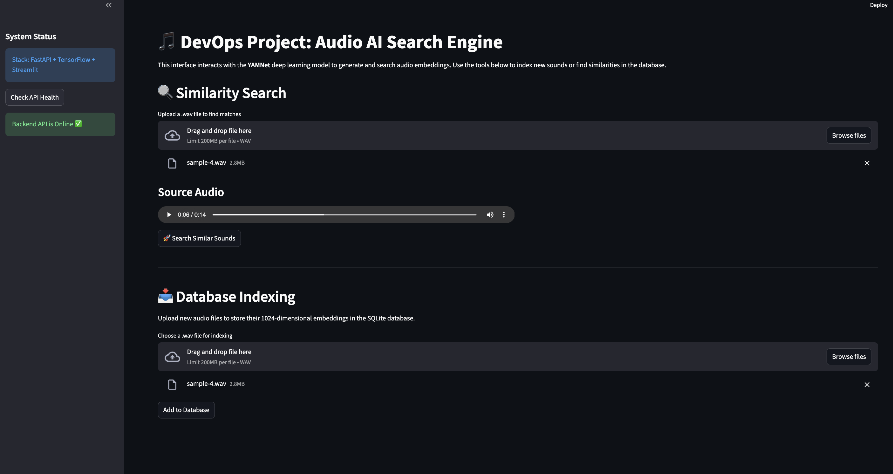

# Audio Embeddings API (DevOps Project) 🎵

A containerized AI-powered microservice that generates, stores, and searches audio embeddings using the **YAMNet** deep learning model.



## 🌟 New Feature: Web Interface

The project now includes a **Streamlit-based UI**, allowing users to interact with the AI model without writing a single line of code.

- **Location:** Access it at `http://localhost:8501`
- **Features:** Real-time similarity search, database indexing, and API health monitoring.

## 🛠 Tech Stack

- **Language:** Python 3.12
- **Frameworks:** FastAPI (Backend) & Streamlit (Frontend)
- **ML Engine:** TensorFlow 2.18 / TensorFlow Hub (YAMNet)
- **Database:** SQLite (Auto-initialized)
- **Orchestration:** Docker & Docker Compose (Multi-container architecture)

## 🚀 Engineering Highlights

- **Microservices:** Separated concerns between Backend (API) and Frontend (UI) using Docker networking.
- **Environment Isolation:** Resolved dependency conflicts between Python 3.12 and `tensorflow-hub` using custom build steps.
- **Resilience:** Integrated Docker **Healthchecks** ensuring the UI waits for the heavy ML model to load before starting.
- **CI/CD ready:** Fully automated testing suite integrated into the workflow.

## Quick Start

1. **Build and Start:**

   ```bash
   docker compose up --build -d
   Note: The first start may take ~1 minute to load the heavy YAMNet model.
   ```

2. **Access Points:**
   - **User Interface:** [http://localhost:8501](http://localhost:8501)
   - **API Documentation (Swagger):** [http://localhost:8000/docs](http://localhost:8000/docs)

## 🔍 API Features

- **POST /embeddings:** Upload a `.wav` file to generate and store a 1024-dimensional vector.
- **POST /search:** Find the most similar audio file in the database using **Cosine Similarity**.
- **GET /docs:** Interactive API documentation.

## 🧪 Testing & Verification

Run logic tests inside the running container:

```bash
docker exec -it audio_embeddings_api pytest test_main.py
```

## Data Verification

To verify that embeddings are successfully stored in the database, run:

```bash
docker compose exec api python -c "import sqlite3; conn = sqlite3.connect('/app/embeddings.db'); print(conn.cursor().execute('SELECT filename FROM audio_data').fetchall()); conn.close()"
```

Arendaja märkused (Developer Notes)

Projekti väljakutsed ja lahendused:
Selle projekti seadistamine Python 3.12 keskkonnas osutus üsna keerukaks. Peamiseks takistuseks oli tensorflow-hub ühilduvus, kuna see sõltus vananenud pkg_resources moodulist, mida uuemates Pythoni versioonides enam vaikimisi ei ole.

Lahendus:
Kasutasin Dockeris eraldi build-etappi, et tagada setuptools==69.5.1 paigaldamine. See võimaldas kasutada kaasaegset Pythoni versiooni ning samal ajal käivitada YAMNet mudelit stabiilselt. Tegemist on hea näitega sellest, kuidas DevOps-lähenemine aitab ületada pärandtarkvaraga seotud piiranguid.

Märkus: Kui logides kuvatakse CUDA-ga seotud hoiatusi, siis ei ole põhjust muretsemiseks – süsteem lülitub automaatselt CPU kasutamisele, mis on Maci riistvara puhul ootuspärane käitumine.
